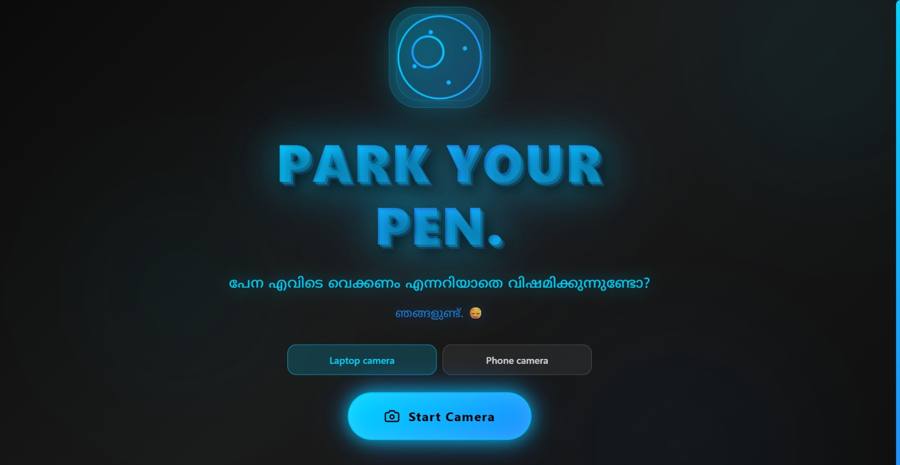
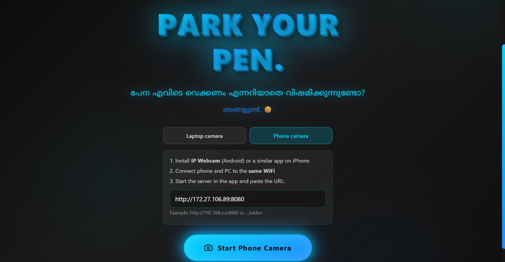
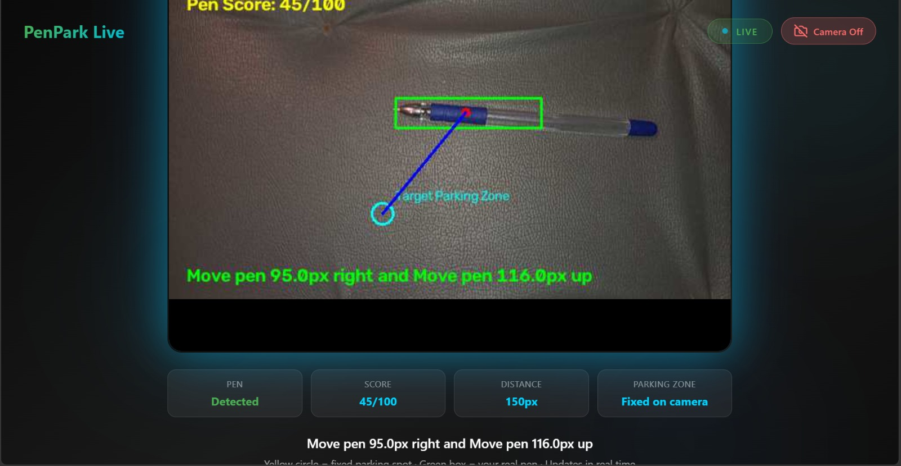
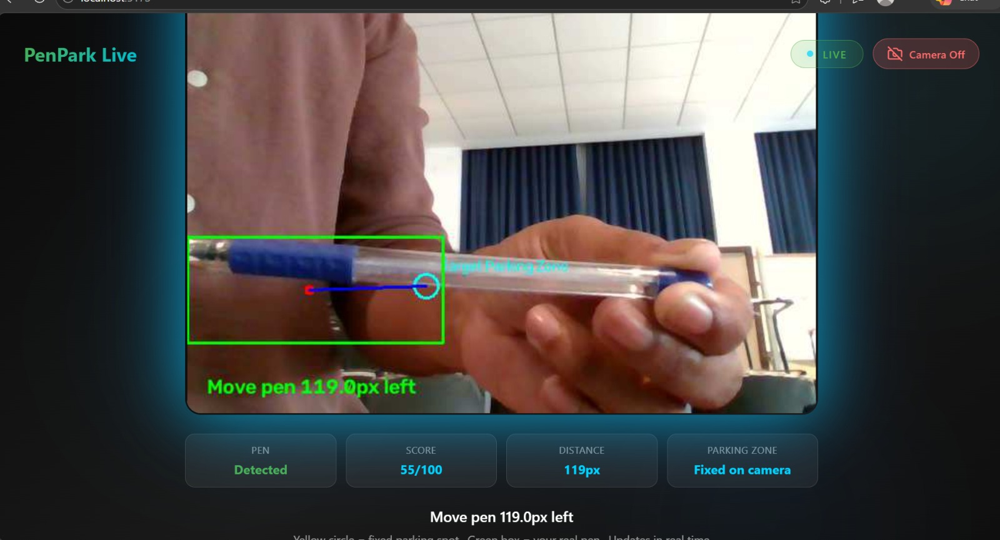

# PenPark - Pen Parking Detection System 🎯

A real-time computer vision system that detects the position, angle, and alignment of a blue pen in a designated parking zone and gives instant guidance for accurate placement. The system combines a Flask backend, OpenCV-based detection, and a React dashboard for live monitoring and feedback.

## 1. Project Overview

### Team Name
Thalipoli

### Team Members
- Team Lead: Muhammad Jasim PC
- Member: Athil Rahuman A S

### Project Description
PenPark is an intelligent pen-parking detection system designed to verify whether a pen is correctly aligned in a target zone using computer vision. It reads live camera input, tracks the pen, calculates center position, angle deviation, and alignment score, and sends real-time instructions back to the user.

This project is intended for interactive demonstrations, smart desk setups, and automated positioning tasks where accurate pen placement matters. It also includes a responsive frontend dashboard for monitoring detection status in real time.

### Problem
People often waste time placing a pen into a fixed parking slot without any feedback, then discover it is crooked, offset, or completely misaligned. There is no simple way to know whether it is correctly parked without manually checking.

### Solution
PenPark solves this by using a live camera feed, OpenCV-based object detection, and instant scoring logic to determine whether the pen is aligned, centered, and oriented correctly. The system shows visual guidance, calculates a score from 0 to 100, and tells the user exactly how to move the pen until it is perfectly parked.

## 2. Core Features

- Real-time pen detection using OpenCV
- Live camera feed with detection overlays
- Alignment scoring from 0 to 100
- Position guidance and movement instructions
- RESTful backend API
- Modern frontend dashboard with React + Vite
- Responsive monitoring interface

## 3. System Flow

1. Camera captures the live video feed.
2. The backend processes each frame using OpenCV.
3. Pen contours are detected and filtered by color.
4. Center position and orientation are calculated.
5. Alignment score is generated against the target zone.
6. The frontend displays the live score and guidance instructions.

## 4. Technologies Used

### Software
- Python 3.10+
- Flask
- OpenCV (`cv2`)
- NumPy
- React.js
- Vite
- JavaScript / JSX
- REST API
- MJPEG live streaming
- HTML / CSS

### Hardware
- Webcam or USB camera
- Laptop or desktop computer
- Optional smartphone camera with an IP webcam app
- Monitor or display for live interface
- Stable platform for pen alignment demo

## 5. Project Structure

```text
penpark/
├── README.md
├── backend/
│   ├── app.py
│   ├── requirements.txt
│   └── ...
├── frontend/
│   ├── src/
│   ├── package.json
│   └── ...
├── images/
│   ├── first_scr.jpeg
│   ├── second_sce.jpeg
│   ├── third_scr.jpeg
│   └── forth_scr.jpeg
├── demo.mp4
├── architecture.png
└── ...
```

## 6. Installation

### Backend
```bash
cd pen-parking-backend
python3 -m venv venv
source venv/bin/activate
pip install -r requirements.txt
```

### Frontend
```bash
cd ../pen-parking-frontend
npm install
```

## 7. Run the Application

### Terminal 1 - Backend
```bash
cd pen-parking-backend
source venv/bin/activate
python app.py
```

### Terminal 2 - Frontend
```bash
cd pen-parking-frontend
npm run dev
```

The backend runs on `http://localhost:5000` and the frontend runs on `http://localhost:5173`.

## 8. API Endpoints

### Health & Status
- `GET /api/health` - Server health check
- `GET /api/camera/status` - Camera streaming status

### Camera Operations
- `POST /api/camera/start` - Start camera streaming
- `POST /api/camera/stop` - Stop camera streaming
- `GET /api/camera/frame` - Get current frame data with pen detection
- `GET /api/camera/video_feed` - Stream video feed (MJPEG)

### Parking Check
- `POST /api/parking/check` - Check pen parking status
- `GET /api/parking/history` - Get parking history
- `GET /api/parking/stats` - Get statistics
- `GET /api/config` - Get system configuration

### Example Request
```bash
curl http://localhost:5000/api/camera/frame
```

### Example Response
```json
{
  "detected": true,
  "center": {"x": 320, "y": 240},
  "angle": 45.5,
  "distance": 25.3,
  "score": 87.5,
  "instruction": "Move pen 15.0px down"
}
```

## 9. Screenshots


*Live camera feed showing the detection area and pen tracking overlay.*


*The dashboard displays real-time position, angle, and score information.*


*The system provides guidance while the pen is moved toward the target zone.*


*The system continues to provide directional feedback until the pen is correctly aligned.*

## 10. Workflow Diagram

(images/archtecture.png)
*The workflow shows camera input, computer vision processing, scoring logic, and frontend updates.*

## 11. Demo

![images/demo1.mp4]
*The video demonstrates real-time pen detection, alignment scoring, and the final parking result.*

## 12. Team Contributions

- Muhammad Jasim PC: Led backend development, camera integration, and pen detection logic.
- Athil Rahuman A S: Designed and developed the React dashboard and live monitoring interface.
- Jasim & Athil: Worked on system testing, calibration, and documentation.

## 13. Future Improvements

- [ ] Database integration for parking history
- [ ] User authentication and profiles
- [ ] Mobile app support (React Native)
- [ ] Multiple camera support
- [ ] Machine learning improvements for detection
- [ ] Advanced analytics dashboard
- [ ] Real-time notifications
- [ ] Multi-language support
- [ ] Docker containerization
- [ ] CI/CD pipeline

## 14. Local Network Access

To run the app on a local network, update the backend configuration:

```python
# In app.py
app.run(host="0.0.0.0", port=5000)
```

Frontend environment variable:

```bash
VITE_API_URL=http://<YOUR_IP>:5000
```

## 15. Deployment

### Docker Deployment (Coming Soon)
```bash
docker-compose up
```

### Production Build
```bash
cd pen-parking-frontend
npm run build
```

## 16. Learning Resources

- [Flask Documentation](https://flask.palletsprojects.com/)
- [React Documentation](https://react.dev/)
- [OpenCV Python Documentation](https://docs.opencv.org/4.x/d6/d00/tutorial_py_root.html)
- [Vite Documentation](https://vitejs.dev/)

---

Made with ❤️ at TinkerHub Useless Projects


